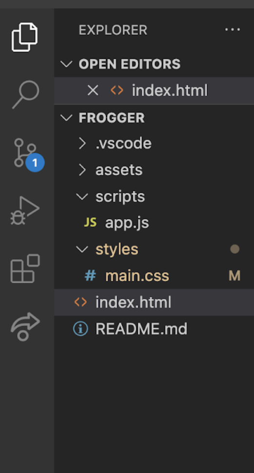
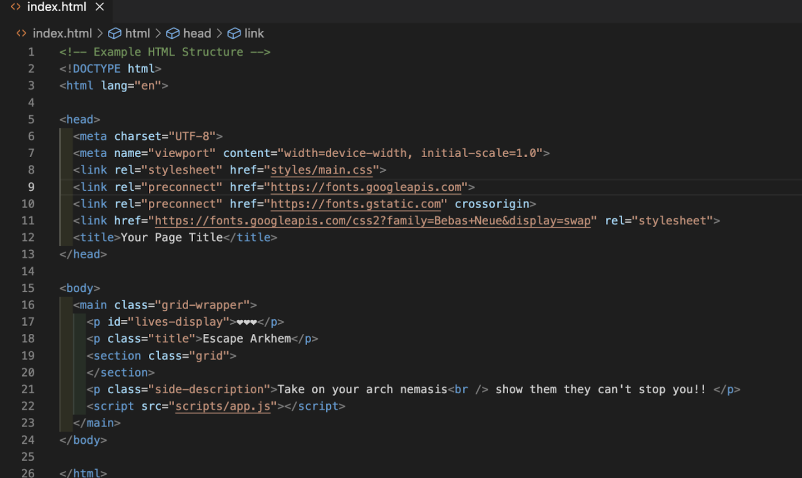
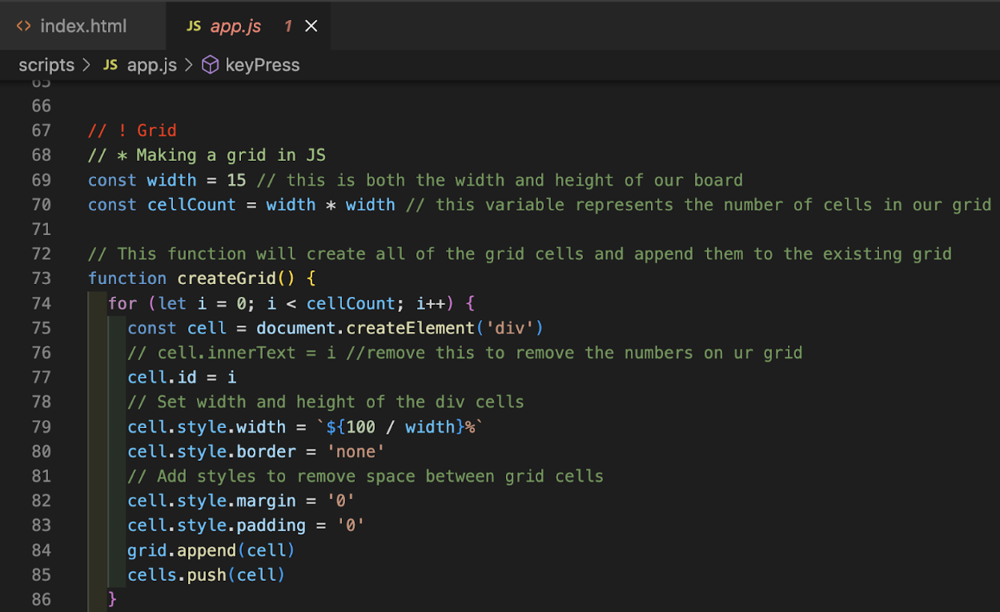
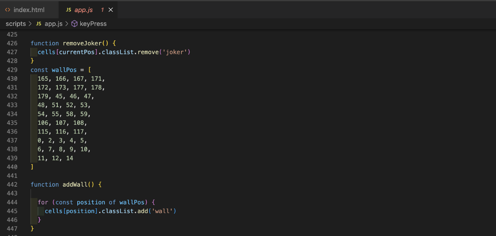
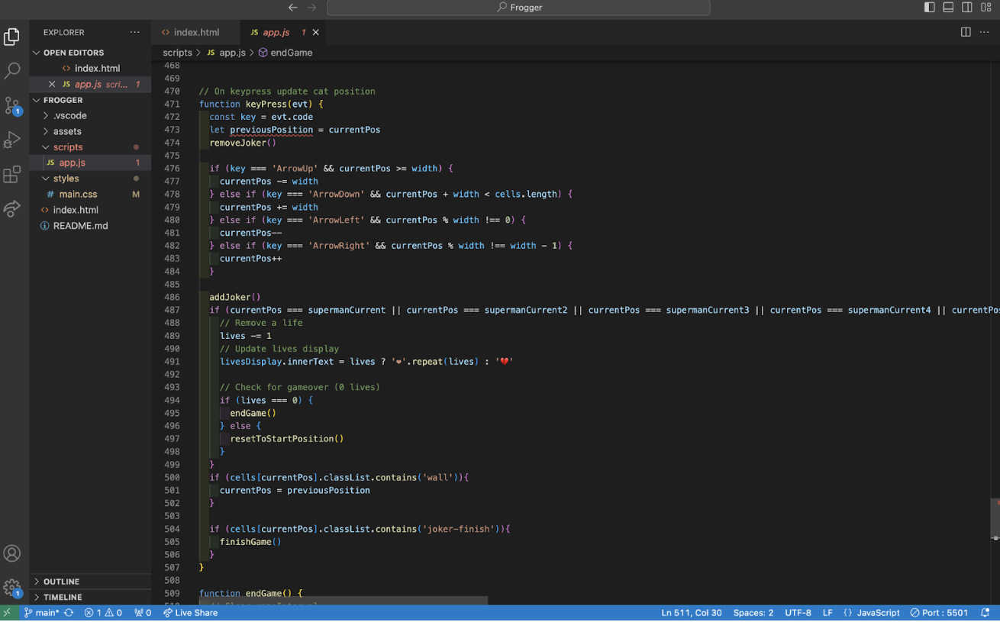
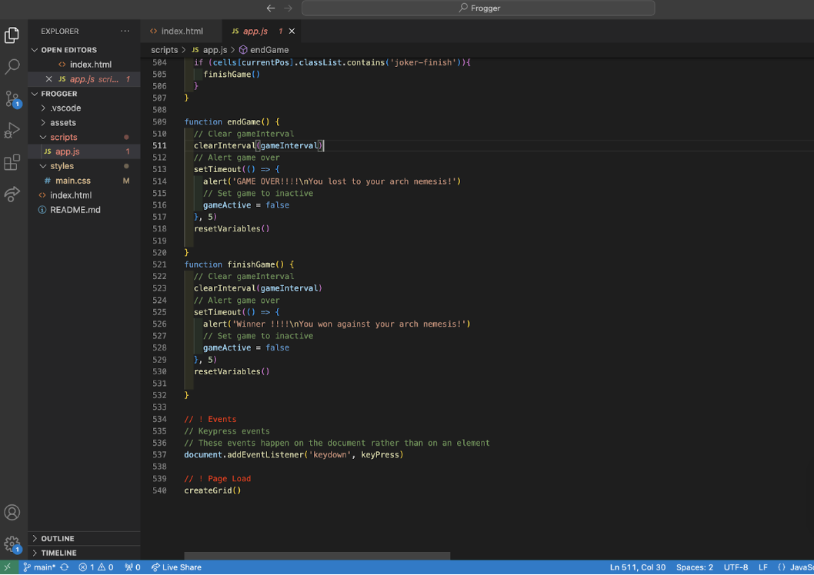

# Frogger

# General Assembly

## Project-1 Frogger

### Overview

This application serves as a platform for playing the game of Frogger. The objective of the game is to navigate from the starting point to the top row image without colliding with the moving superheroes, thereby achieving victory. The gameplay is characterized by its intensity and entertainment value. Players have the freedom to move within the game environment but are restricted from passing through walls.

### Website Link

[Escape-Arkham](http://127.0.0.1:5501/index.html) 

### Technology Used

- JavaScript
- HTML
- CSS

### Brief

Within a designated one-week timeframe, my goal was to develop a fully operational game incorporating both win and lose conditions. The requirements outlined by the instructor called for the game to be designed for single-player use, with obstacles generated automatically and for there to be a win and loss condition.

### Planning

Before commencing the project, I initially wrote some pseudocode as an initial step. Regrettably, I accidentally deleted it. Nonetheless, I proceeded to organize my files thoroughly and outline the functions essential for my game. Additionally, I deliberated upon a suitable theme to support the game's concept.

### Approach Taken

**Day 1**: I outlined my plan and sought inspiration from existing games while striving to develop my unique theme. I also structured all of my files and folders accordingly, so it would be easier for me.

**Day 2**: I commenced coding, starting with the HTML portion, which progressed smoothly. I then engaged deeply in JavaScript functionality, leveraging lessons from previous coursework, which provided a helpful starting point.

**Day 3**: My focus shifted to implementing obstacles and walls to ensure their visibility within the grid.

**Day 4**: I introduced functionality to deduct a life upon collision with an obstacle, subsequently incorporating a lose condition.

**Day 5**: Enhancements included the addition of a win condition and the implementation of randomized movement for obstacles across the grid. However, the visual presentation required refinement.

**Day 6**: I conducted a comprehensive review to ensure the game's functionality and to address any existing bugs.

**Day 7**: I presented the project to the instructor and awaited evaluation on its performance.

### Project Wins and Key Learnings

I have successfully developed a fully operational game ready for player interaction.

I take pride in my resilience and perseverance when encountering errors and refining the theme of the page. Despite facing challenges, I remained steadfast and determined to overcome my obstacles.

A key learning from this experience is the importance of dedicating sufficient time to refining the smaller details and enhancing functionalities for a better user experience.

### Challenges

The most significant challenge I encountered was attempting to make everything dynamic, which unfortunately I was unable to achieve. Additionally, I struggled with programming the movement of the automated obstacles.

### Future Improvements

A future improvement could involve synchronizing the movement of obstacles to enhance the overall visual appeal of the game.
